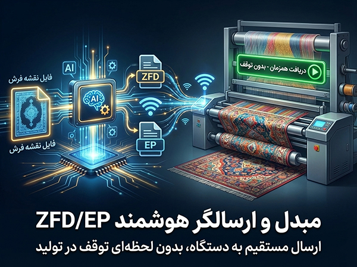

# 🌟 وفا سافت (Vafa-Soft) | وب‌سایت معرفی و دانلود نرم‌افزارهای تخصصی نساجی و ویندوز

<p align="center">
  
</p>

<p align="center">
  <strong>مجموعه نرم‌افزارهای تخصصی طراحی، تبدیل فرمت، پردازش و بافت فرش ماشینی</strong><br>
  توسعه داده شده توسط <b>علیرضا وفاخواه</b> | کارشناس نرم‌افزار و فعال صنعت IT و نساجی (کاشان)
</p>

<p align="center">
  <a href="https://alirezavafakhah.github.io/Vafa-Soft/"></a>
  
  
  
</p>

---

## 📋 فهرست مطالب
- [معرفی پروژه](#-معرفی-پروژه)
- [کاتالوگ نرم‌افزارهای تخصصی وفا سافت](#-کاتالوگ-نرم‌افزارهای-تخصصی-وفا-سافت)
- [ویژگی‌ها و قابلیت‌های فنی وب‌سایت](#-ویژگی‌ها-و-قابلیت‌های-فنی-وب‌سایت)
- [ساختار فایل‌ها و دایرکتوری‌ها](#-ساختار-فایل‌ها-و-دایرکتوری‌ها)
- [راهنمای راه‌اندازی و اجرای محلی](#-راهنمای-راه‌اندازی-و-اجرای-محلی)
- [راهنمای استقرار (Deploy) روی GitHub Pages](#-راهنمای-استقرار-deploy-روی-github-pages)
- [راهنمای شخصی‌سازی و توسعه](#-راهنمای-شخصی‌سازی-و-توسعه)
- [اطلاعات تماس و پشتیبانی](#-اطلاعات-تماس-و-پشتیبانی)
- [لایسنس](#-لایسنس)

---

## 📖 معرفی پروژه

**وفا سافت (Vafa-Soft)** یک پورتال وب مدرن، کاملاً ریسپانسیو و سریع است که با هدف معرفی، ارائه مشخصات فنی، تصاویر محیط نرم‌افزار و لینک‌های دانلود نرم‌افزارهای تخصصی و کاربردی سیستم‌عامل ویندوز (به‌ویژه نرم‌افزارهای صنعت طراحی و بافت فرش ماشینی و نساجی) ایجاد شده است.

این وب‌سایت بدون وابستگی به فریم‌ورک‌های سنگین و تنها با **Pure HTML5**، **Vanilla CSS3** و **Modern JavaScript (ES6+)** پیاده‌سازی شده و از استانداردهای روز طراحی رابط کاربری (UI/UX)، حالت دوگانه روز/شب (Dark/Light Theme) و پشتیبانی بومی از زبان فارسی (RTL) بهره می‌برد.

---

## 💻 کاتالوگ نرم‌افزارهای تخصصی وفا سافت

این وب‌سایت شامل ۵ صفحه اختصاصی کامل برای ۵ نرم‌افزار کاربردی در صنعت فرش ماشینی و طراحی کامپیوتری است:

| رديف | نام نرم‌افزار | صفحه اختصاصی | نسخه | حجم | سیستم‌عامل | کاربرد اصلی |
| :---: | :--- | :---: | :---: | :---: | :---: | :--- |
| **۱** | **مبدل ZFD/EP**<br>*(Vafa ZFD/EP Convertor)* | [مشاهده صفحه](app-zfd-converter.html) | `3.2.0` | `60 MB` | ویندوز 7/10/11 | تبدیل فرمت‌های گرافیکی به فایل بافت، ارسال مستقیم تحت شبکه به دستگاه‌های ZFD و EP بدون توقف دستگاه |
| **۲** | **چیدمان هوشمند فرش**<br>*(Smart Layout / BMP Creator)* | [مشاهده صفحه](app-bmp-creator.html) | `2.4.1` | `45 MB` | ویندوز 10/11 (64-bit) | چیدمان هوشمند نقشه‌ها برای رول‌بافی، کناره‌بافی و پادری‌بافی با ادغام هوشمند مرزهای رنگی |
| **۳** | **سازماندهی پالت رنگ**<br>*(Pallet Reorder)* | [مشاهده صفحه](app-pallet-reorder.html) | `1.0.0` | `35 MB` | ویندوز 10/11 (64-bit) | مرتب‌سازی پالت توسط پروفایل، ادغام رنگ‌های مشابه و خروجی سازگار با ماشین‌های تکسیما (Texima) |
| **۴** | **نقش ساز پلاس**<br>*(Naghsh Saz Plus)* | [مشاهده صفحه](app-naghshsaz.html) | `2.5.0` | `45 MB` | ویندوز 10/11 (64-bit) | افزایش راندمان طراحی فرش، ایجاد میانبرهای سریع، باز کردن نقشه در ویندوز و پالت رنگ پیشرفته |
| **۵** | **آنالیز رنگ فرش**<br>*(Color Analyser)* | [مشاهده صفحه](app-color-analyser.html) | `1.5.2` | `15 MB` | ویندوز 7/10/11 | محاسبه دقیق درصد مساحت هر رنگ در نقشه جهت برآورد دقیق مصرف نخ، تار و پود و انبارداری |

### بررسی اجمالی قابلیت‌های نرم‌افزارها:
1. **مبدل ZFD/EP:** تبدیل فرمت‌های `BMP`، `PCX`، `PNG` و `GIF`، تبدیل معکوس فایل بافت به تصویر، تعریف پروفایل شانه و تراکم، ارسال و مدیریت فایل‌ها از راه دور تحت شبکه.
2. **چیدمان هوشمند فرش:** الگوریتم‌های ترکیب و تطبیق مرز رنگ‌ها، محاسبه دقیق مختصات متری، پیش‌نمایش بلادرنگ و ابزارهای ویرایشی پیشرفته.
3. **سازماندهی پالت رنگ:** مرتب‌سازی بر اساس شدت و درصد حضور رنگ در طرح، فشرده‌سازی و حذف رنگ‌های همنام/تکراری، پشتیبانی کامل از استاندارد PCX تکسیما.
4. **نقش ساز پلاس:** پردازش سریع تصویر بدون فریز، پیش‌نمایش پرسرعت فایل‌های سنگین در شل ویندوز، شورت‌کات‌های کاربردی برای افزایش سرعت طراحان.
5. **آنالیز رنگ فرش:** پردازش سریع فایل‌های گیگابایتی و نقشه‌های با تراکم بالا، محاسبه فوری متراژ و وزن نخ مورد نیاز در خط تولید.

---

## 🎨 ویژگی‌ها و قابلیت‌های فنی وب‌سایت

### ۱. معماری و رابط کاربری مدرن (UI/UX)
- **تم دوگانه پویا (Dark / Light Mode):** ذخیره‌سازی وضعیت تم در `localStorage` و تشخیص خودکار تم پیش‌فرض سیستم‌عامل کاربر (`prefers-color-scheme`).
- **تایپوگرافی استاندارد فارسی:** استفاده از فونت محبوب و خوانای **وزیرمتن (Vazirmatn)** به همراه آیکون‌های وکتور **Font Awesome 6.4.0**.
- **طراحی کاملاً واکنش‌گرا (Responsive):** بهینه‌سازی شده با CSS Flexbox و Grid برای نمایش بی‌نقص در موبایل، تبلت، لپ‌تاپ و نمایشگرهای عریض.
- **افکت‌های بصری پیشرفته:**
  - هدر شیشه‌ای و مات با افکت `backdrop-filter: blur(10px)`.
  - انیمیشن‌های ورود نرم المان‌ها به هنگام اسکرول با استفاده از `IntersectionObserver`.
  - افکت ۳ بعدی جذاب پارالاکس و تیلت روی پوستر برنامه‌ها (`init3DTiltEffect` بر اساس مختصات ماوس).

### ۲. اسلایدر هوشمند بنر (Smart Hero Slider)
- پشتیبانی از سوایپ لمسی (Touch Swipe) متناسب با جهت راست به چپ (RTL).
- تغییر خودکار اسلایدها با قابلیت توقف هنگام قرارگیری نشانگر ماوس (Hover Pause).
- کنترل با دکمه‌های ناوبری، نقاط نشانگر (Dots) و کلیدهای جهت‌نمای کیبورد.
- **تشخیص خودکار روشنایی گرادیان پس‌زمینه (Adaptive Text Color):** محاسبه میانگین روشنایی با فرمول استاندارد Rec. 601 و تنظیم خودکار رنگ متن به تیره یا روشن جهت خوانایی حداکثری.
- قابلیت کلیک روی هر اسلاید برای انتقال سریع به صفحه مربوطه.

### ۳. گالری تصاویر و لایت‌باکس تعاملی (Lightbox Modal)
- نمایش فول‌اسکرین تصاویر و اسکرین‌شات‌های محیط کاربری نرم‌افزارها.
- همراه با نمایش کپشن و عنوان اختصاصی هر تصویر.
- ناوبری کامل بین تصاویر قبلی/بعدی با ماوس یا کلیدهای جهت‌نمای کیبورد و بستن با کلید `Escape`.
- جلوگیری از اسکرول صفحه در زمان فعال بودن لایت‌باکس.

### ۴. فرم ارتباط با ما (AJAX Contact Form)
- اتصال به سرویس امن **FormSubmit.co** از طریق ارسال غیرهمگام `fetch()`.
- اعتبارسنجی فیلدها و نمایش وضعیت انتظار (Loading Spinner) روی دکمه ارسال.
- نمایش اعلان شناور سفارشی (Toast Notification) پس از ارسال موفق یا ناموفق پیام.

---

## 📂 ساختار فایل‌ها و دایرکتوری‌ها

```text
WebSite/
├── index.html                  # صفحه اصلی وب‌سایت (هیرو اسلایدر، کاتالوگ، بخش درباره من و تماس)
├── app-zfd-converter.html      # صفحه اختصاصی نرم‌افزار مبدل ZFD/EP
├── app-bmp-creator.html        # صفحه اختصاصی نرم‌افزار چیدمان هوشمند فرش
├── app-pallet-reorder.html     # صفحه اختصاصی نرم‌افزار سازماندهی پالت رنگ
├── app-naghshsaz.html          # صفحه اختصاصی نرم‌افزار نقش ساز پلاس
├── app-color-analyser.html     # صفحه اختصاصی نرم‌افزار آنالیز رنگ فرش
├── .nojekyll                   # جلوگیری از اجرای Jekyll در گیت‌هاب پیجز برای بارگذاری بی‌نقص تمام پوشه‌ها
├── README.md                   # مستندات جامع، معرفی و راهنمای پروژه
├── css/
│   └── style.css               # فایل استایل جامع (شامل متغیرهای تم، گریدها، ریپانسور و لایت‌باکس)
├── js/
│   └── main.js                 # هسته اسکریپت‌ها (اسلایدر، لایت‌باکس، تیلت سه‌بعدی، تم، فرم تماس)
├── apps/                       # تصاویر و اسکرین‌شات‌های گرافیکی باکیفیت از نرم‌افزارها (۲۹ تصویر)
│   ├── ZFD_Converter.jpg & ZFD_Converter-info-1..6.jpg
│   ├── Bmp-Creator.jpg & Bmp-Creator-info-1..9.jpg
│   ├── PalletReorder.jpg & PalletReorder-info-1..3.jpg
│   ├── naghshsaz.jpg / .png & naghshaz-info-01..03.jpg
│   └── ColorAnalyser.jpg & ColorAnalyser-ino-1..2.jpg
└── Use in OnlineSite/          # دایرکتوری آماده‌سازی و دیپلوی مستقیم به ریپازیتوری آنلاین گیت‌هاب
```

---

## 🚀 راهنمای راه‌اندازی و اجرای محلی

برای اجرای این پروژه نیازی به نصب هیچ‌گونه ابزار بیلد، Node.js یا پکیج اضافی نیست:

1. کل ریپازیتوری را دانلود کرده یا کلون کنید:
   ```bash
   git clone https://github.com/alirezavafakhah/Vafa-Soft.git
   ```
2. کافیست فایل `index.html` را در هر مرورگر مدرنی (مانند Chrome, Firefox, Edge, Safari) باز کنید.
3. در صورت تمایل به استفاده از سرور محلی (Local Server) می‌توانید از اکستنشن **Live Server** در VS Code یا دستور پایتون استفاده کنید:
   ```bash
   # اجرای سرور لوکال با پایتون ۳
   python -m http.server 8000
   ```
   سپس آدرس `http://localhost:8000` را در مرورگر مشاهده فرمایید.

---

## 🌐 راهنمای استقرار (Deploy) روی GitHub Pages

این پروژه به همراه فایل `.nojekyll` تنظیم شده و آماده استقرار فوری روی **GitHub Pages** می‌باشد:

1. یک ریپازیتوری در گیت‌هاب با نام دلخواه (مثلاً `Vafa-Soft`) بسازید.
2. کدها را به ریپازیتوری ارسال کنید:
   ```bash
   git init
   git add .
   git commit -m "Deploy Vafa-Soft Website"
   git branch -M main
   git remote add origin https://github.com/alirezavafakhah/Vafa-Soft.git
   git push -u origin main
   ```
3. در گیت‌هاب به بخش **Settings** > **Pages** بروید.
4. در بخش **Build and deployment**، گزینه **Source** را روی `Deploy from a branch` قرار دهید و شاخه `main` و ریشه `/ (root)` را انتخاب کرده و روی **Save** کلیک کنید.
5. پس از چند لحظه سایت شما در آدرس زیر آنلاین خواهد بود:
   ```text
   https://alirezavafakhah.github.io/Vafa-Soft/
   ```

---

## 🛠️ راهنمای شخصی‌سازی و توسعه

### ۱. تغییر لینک‌های دانلود واقعی فایل‌ها
در صفحات `index.html` و صفحات اختصاصی `app-*.html`، در بخش دکمه‌های دانلود به جای `href="#"` لینک مستقیم فایل نصاب (`.exe` یا `.zip`) خود را قرار دهید:
```html
<a href="https://your-domain.com/downloads/setup.exe" class="btn btn-primary">
    <i class="fas fa-download"></i> دانلود مستقیم نرم‌افزار
</a>
```

### ۲. شخصی‌سازی رنگ‌ها و متغیرهای طراحی
در فایل `css/style.css` تمام متغیرهای سراسری سیستم طراحی در بخش `:root` و `[data-theme="dark"]` تعریف شده‌اند:
```css
:root {
    --primary-color: #667eea;    /* رنگ اصلی تم روشن */
    --secondary-color: #764ba2;  /* رنگ ثانویه تم روشن */
    --bg-color: #f8f9fa;         /* پس‌زمینه سایت */
    /* ... */
}

[data-theme="dark"] {
    --primary-color: #8c9eff;    /* رنگ اصلی تم تاریک */
    --bg-color: #121212;         /* پس‌زمینه تم تاریک */
    /* ... */
}
```

### ۳. تغییر ایمیل دریافت پیام‌های فرم تماس
در فایل `js/main.js` خط مربوط به درخواست AJAX به FormSubmit را ویرایش کنید:
```javascript
fetch('https://formsubmit.co/ajax/YOUR_EMAIL@gmail.com', {
    method: 'POST',
    body: formData
})
```

---

## 📞 اطلاعات تماس و پشتیبانی

برای سفارش پروژه‌های نرم‌افزاری صنعتی، مشاوره یا خرید نسخه‌های کامل نرم‌افزارها می‌توانید با اطلاعات زیر در ارتباط باشید:

- 👤 **توسعه‌دهنده:** علیرضا وفاخواه (Alireza Vafakhah)
- 📍 **موقعیت:** ایران، کاشان
- 📧 **ایمیل:** [AVF69Programmer@Gmail.Com](mailto:AVF69Programmer@Gmail.Com)
- 📱 **واتس‌اپ / تلفن همراه:** [`+98 913 277 2836`](https://wa.me/989132772836)
- 🐙 **گیت‌هاب:** [alirezavafakhah](https://github.com/alirezavafakhah)
- 🌐 **آدرس وب‌سایت آنلاین:** [alirezavafakhah.github.io/Vafa-Soft](https://alirezavafakhah.github.io/Vafa-Soft/)

---

## 📄 لایسنس

تمامی حقوق مادی و معنوی نرم‌افزارها و محتوای این وب‌سایت متعلق به **وفا سافت (علیرضا وفاخواه)** می‌باشد © ۱۴۰۴.
استفاده از ساختار وب‌سایت برای مقاصد غیرتجاری با ذکر منبع بلامانع است.
